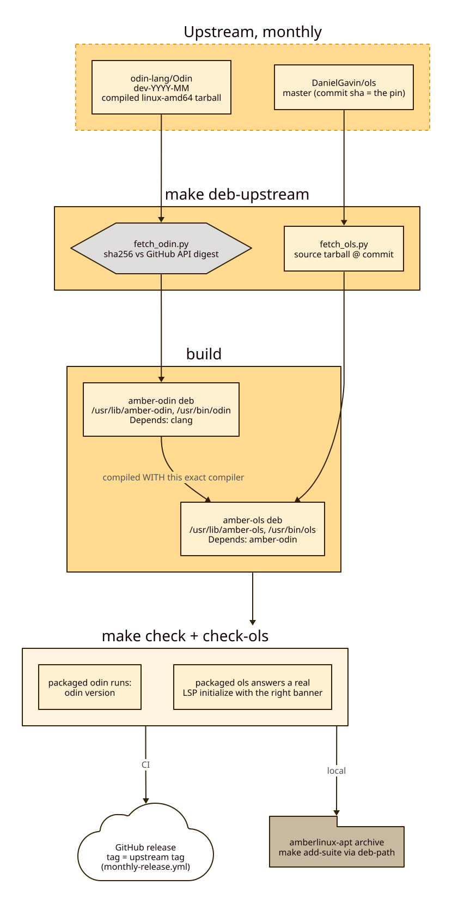

# amber-odin

Debian packaging for the upstream Odin compiler and the `ols` language server.

It exists for Amber Linux projects that need a predictable `/usr/bin/odin`
compiler on Linux Mint without depending on Ubuntu's unrelated `odin` package.

Two packages come out of one build:

| package | contents | binary |
|---|---|---|
| `amber-odin` | the upstream compiler tree under `/usr/lib/amber-odin` | `/usr/bin/odin` symlink |
| `amber-ols` | the `ols` language server under `/usr/lib/amber-ols`, built from source against the packaged compiler | `/usr/bin/ols` symlink |

`amber-ols` declares `Depends: amber-odin`, so the server always matches the
compiler it was built against. `make deb` builds both — `deb-ols` is a
prerequisite of `deb`, so there is no way to ship one without the other.

Amber Linux uses Odin as the primary language for native Linux Mint software.

**In CI:** [`setup-amber-odin`](https://github.com/marketplace/actions/setup-amber-odin)
installs this package on an Ubuntu runner, so a workflow gets the same compiler
without a source build.

```yaml
- uses: Hyperquader-Coders/setup-amber-odin@v1
- run: odin version
```
Amber Linux: https://amberlinux.org

Upstream Odin:

- Website: https://odin-lang.org/
- Source: https://github.com/odin-lang/Odin
- Releases: https://github.com/odin-lang/Odin/releases

Upstream ols:

- Source: https://github.com/DanielGavin/ols

The two are pinned differently. Odin comes from a tagged release, sha256-verified
against the digest the GitHub API reports. ols has no releases to track, so it is
built from **master head** unless `OLS_COMMIT` names a sha — and that sha is the
pin, recorded in `build/ols-src/COMMIT` and in the package changelog, so a built
deb always says which commit it carries.

## Workflow

The normal path — fetch the latest compiled upstream release
(sha256-verified against the digest the GitHub API reports), package it,
and run the checks, which include executing the packaged compiler:

```sh
make deb-upstream                    # latest upstream release
make deb-upstream TAG=dev-2026-08   # a specific one
```



CI does the same monthly: `.github/workflows/monthly-release.yml` runs on
a schedule, skips when the upstream tag is already released here, and
otherwise publishes the deb as a GitHub release tagged like upstream.

Individual targets, when the whole path is more than you want:

```sh
make fetch-ols      # clone/refresh the ols source (OLS_COMMIT pins it)
make deb-ols        # build amber-ols against SOURCE_DIR's compiler
make check-ols      # assert the package name, version, Depends and payload
```

Check whether upstream has a newer Odin release:

```sh
make release-check
```

Build and validate from a local Odin install instead (`SOURCE_DIR`
defaults to the directory of the `odin` on `PATH`):

```sh
make check
```

Create the release manifest:

```sh
make release
```

This writes `RELEASE.md` with the package version, packaged Odin version, deb
path, file size, and SHA256 hash.

Releases go out through the suite's own apt archive. The deb is ingested by
[`amberlinux-apt`](https://github.com/Hyperquader-Coders/amberlinux-apt), whose
`make add-suite` picks up the newest build in `dist/` via `make deb-path`; its
`make stage` then assembles and verifies the archive, and `make deploy` uploads it.

## Updating Odin

`make deb-upstream` derives `VERSION` from the upstream tag
(`dev-YYYY-MM` → `YYYY.MM+dev`) and generates the Debian changelog at
build time — nothing to edit by hand. `VERSION` in the Makefile is only
the default for local `SOURCE_DIR` builds; bump it when you use that path.

## Roadmap

The prioritized backlog lives in [MoSCoW.md](MoSCoW.md).

## Licence

This repository's own packaging tooling (Makefile, `scripts/`, `packaging/`
templates) is BSD-3-Clause — the same licence as the compiler it packages, so
nothing here is more restrictive than upstream. See [LICENSE](LICENSE).

The Odin compiler this tooling repackages keeps its own upstream BSD-3-Clause
licence, and the `amber-ols` package is built from
[DanielGavin/ols](https://github.com/DanielGavin/ols) under MIT —
both recorded in `packaging/debian/copyright`.
